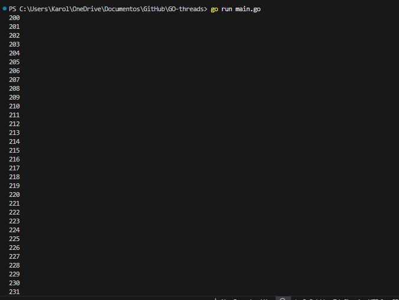
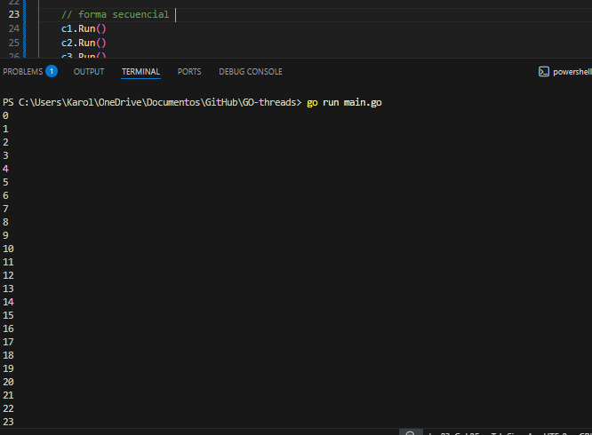
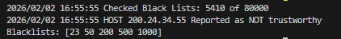
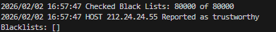
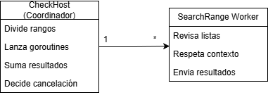

### Escuela Colombiana de Ingeniería
### Arquitecturas de Software - ARSW
## Ejercicio Introducción al paralelismo - Hilos - Caso BlackListSearch

- Jared Sebastian Farfan Guevara 
- Carolina Cepeda Valencia

### Dependencias:
####   Lecturas:
*  [Threads vs Processes]( http://cs-fundamentals.com/tech-interview/java/differences-between-thread-and-process-in-java.php)

### Descripción
  Este ejercicio contiene una introducción a la programación con go routines (hilos), además de la aplicación a un caso concreto.
  

**Parte I - Introducción a Go routines en GO**

Complete el método main para que el hilo imprima números en un intervalo dado.

Al hacer uso de un start mockeado para similitudes con main, se observa que se imprimen las rutinas de forma secuencial, es decir, primero se imprimen los números de un hilo y luego los de los siguientes.A su vez, se muestra que el orden de ejecución de los hilos no es determinista, ya que al correr varias veces el programa, el orden de los hilos cambia.Se observa lo siguiente: 

Por otro lado, al usar run (sin intentar hacerlo concurrente con el comando go), se observa que los números se imprimen de forma concurrente, es decir, los números de los diferentes hilos no se mezclan en la salida estándar.Como se observa a continuación:

**Parte II - Ejercicio Black List Search**

Para un software de vigilancia automática de seguridad informática se está desarrollando un componente encargado de validar las direcciones IP en varios miles de listas negras (de host maliciosos) conocidas, y reportar aquellas que existan en al menos cinco de dichas listas. 

Al usarse el módulo, la evidencia de que se hizo el registro como 'confiable' o 'no confiable' se dá por lo mensajes de LOGs:

INFO: HOST 205.24.34.55 Reported as trustworthy

INFO: HOST 205.24.34.55 Reported as NOT trustworthy

Al programa de prueba provisto (Main), le toma sólo algunos segundos análizar y reportar la dirección provista (200.24.34.55), ya que la misma está registrada más de cinco veces en los primeros servidores, por lo que no requiere recorrerlos todos. Sin embargo, hacer la búsqueda en casos donde NO hay reportes, o donde los mismos están dispersos en las miles de listas negras, toma bastante tiempo.

Para 'refactorizar' este código, y hacer que explote la capacidad multi-núcleo de la CPU del equipo, realice lo siguiente:

	* Agregue al método 'checkHost' un parámetro entero N, correspondiente al número de hilos entre los que se va a realizar la búsqueda (recuerde tener en cuenta si N es par o impar!). 
    
En la implementación en Go, el parámetro N (workersCount) representa la cantidad de unidades de ejecución concurrente (goroutines) que se utilizarán para realizar la búsqueda en paralelo. Aunque Go no maneja hilos como objetos explícitos, cada goroutine cumple conceptualmente el mismo rol que un hilo en Java. 

    * Modifique el código de este método para que divida el espacio de búsqueda entre las N partes indicadas, y paralelice la búsqueda a través de N hilos. Haga que dicha función espere hasta que los N hilos terminen de resolver su respectivo sub-problema, agregue las ocurrencias encontradas por cada hilo a la lista que retorna el método, y entonces calcule (sumando el total de ocurrencuas encontradas por cada hilo) si el número de ocurrencias es mayor o igual a _BLACK_LIST_ALARM_COUNT_. Si se da este caso, al final se DEBE reportar el host como confiable o no confiable, y mostrar el listado con los números de las listas negras respectivas.

 La sincronización se realiza mediante un sync.WaitGroup, el cual cumple el rol equivalente al método join() de Java, garantizando que el método principal espere hasta que todas las goroutines hayan finalizado la resolución de su sub-problema. Una vez completada la ejecución concurrente, el coordinador agrega las ocurrencias encontradas por cada goroutine, calcula el total de apariciones de la dirección IP y determina si este valor es mayor o igual a BLACK_LIST_ALARM_COUNT, reportando finalmente el host como confiable o no confiable y retornando la lista de índices de las listas negras donde fue encontrado.

	* Dentro del método checkHost Se debe mantener el LOG que informa, antes de retornar el resultado, el número de listas negras revisadas VS. el número de listas negras total (línea 60). Se debe garantizar que dicha información sea verídica bajo el nuevo esquema de procesamiento en paralelo planteado.
En el esquema paralelo, esta información se garantiza como verídica debido a que cada goroutine reporta explícitamente la cantidad de listas que efectivamente evaluó, y el coordinador acumula dichos valores antes de emitir el LOG.

	* Se sabe que el HOST 202.24.34.55 está reportado en listas negras de una forma más dispersa, y que el host 212.24.24.55 NO está en ninguna lista negra.

##### Comparación con diseño en java
En la implementación en Go, se utiliza un enfoque basado en goroutines y canales para lograr la concurrencia y comunicación entre las unidades de ejecución. Cada goroutine maneja su propia porción del espacio de búsqueda y reporta sus resultados a través de canales, lo que facilita la coordinación y recolección de resultados.En donde el CheckHost funciona como un coordinador que lanza múltiples goroutines para realizar búsquedas en paralelo, y luego recopila y procesa los resultados.

**Parte III - Evaluación de Desempeño**

A partir de lo anterior, implemente la siguiente secuencia de experimentos para realizar las validación de direcciones IP dispersas (por ejemplo 202.24.34.55), tomando los tiempos de ejecución de los mismos (asegúrese de hacerlos en la misma máquina):

1. Un solo hilo.
2. Tantos hilos como núcleos de procesamiento 
3. Tantos hilos como el doble de núcleos de procesamiento.
4. 50 hilos.
5. 100 hilos.

Con lo anterior, y con los tiempos de ejecución dados, haga una gráfica de tiempo de solución vs. número de hilos. Analice y plantee hipótesis con su compañero para las siguientes preguntas :

**Parte IV - Ejercicio Black List Search**

1. Según la [ley de Amdahls](https://www.pugetsystems.com/labs/articles/Estimating-CPU-Performance-using-Amdahls-Law-619/#WhatisAmdahlsLaw?):

	, donde _S(n)_ es el mejoramiento teórico del desempeño, _P_ la fracción paralelizable del algoritmo, y _n_ el número de hilos, a mayor _n_, mayor debería ser dicha mejora. Por qué el mejor desempeño no se logra con los 500 hilos?, cómo se compara este desempeño cuando se usan 200?. 

2. Cómo se comporta la solución usando tantos hilos de procesamiento como núcleos comparado con el resultado de usar el doble de éste?.

3. De acuerdo con lo anterior, si para este problema en lugar de 100 hilos en una sola CPU se pudiera usar 1 hilo en cada una de 100 máquinas hipotéticas, la ley de Amdahls se aplicaría mejor?. Si en lugar de esto se usaran c hilos en 100/c máquinas distribuidas (siendo c es el número de núcleos de dichas máquinas), se mejoraría?. Explique su respuesta.

